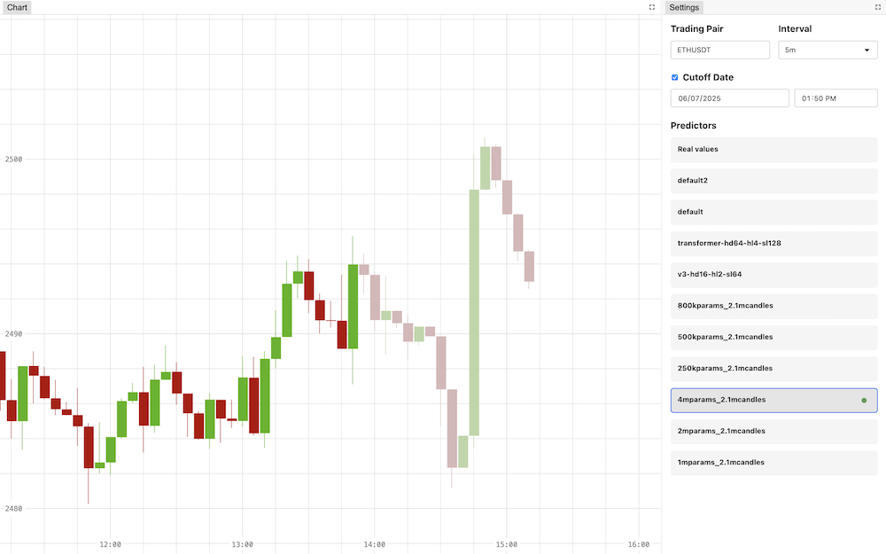

# CoTrader

**Predicts crypto price movements** using historical trading data. CoTrader analyzes candle patterns to forecast future prices, helping traders make smarter decisions.

> ⚠️ Heads up! Full setup and training takes **1+ hours**
> (15min data loading + 40-45min training). Interrupting is not supported.

## What's Inside

- [How It Works](#how-it-works)
- [Setup](#setup)
- [Training & Validation](#training--validation)
- [Making Predictions](#making-predictions)
- [Live Web Dashboard](#live-web-dashboard)
- [Project Structure](#project-structure)
- [License & Credits](#license--credits)

## How It Works

CoTrader analyzes cryptocurrency candle data containing:
- Opening/Closing prices
- High/Low values
- Trading volume

**Prediction workflow**:
1. Processes historical data into technical features
2. Trains ML models to forecast next candle(s)
3. Simulates trading strategies to evaluate profit potential

### Key Metrics Tracked
- **Annual profit projections**: Estimates yearly returns
- **Prediction accuracy**: % of correct price direction calls
- **Loss metrics**: Model training performance

The profit estimates are calculated within a Lightning callback located in `profit_logger.py`. It simulates the following strategy:

1. For each candle, the model predicts whether the next candle's closing price will be higher or lower
2. The bot takes a position (buy/sell) based on this prediction:
    - If predicted to rise: goes long (buys)
    - If predicted to fall: goes short (sells)
3. Each position uses a fixed percentage of capital (default: 1%, configurable via parameter)
4. Profit metrics are calculated by comparing predicted vs. actual price movements


---

## Setup

### Prerequisites
- Python 3.10+
- Poetry (dependency manager)

```bash
# Clone & setup
git clone https://github.com/jakmobius/cotrader.git
cd cotrader
poetry install
pre-commit install  # Activates code quality checks
```

---

## Training & Validation

### Train a Model
```bash
python train.py
```
**What happens**:
1. Fetches historical data from Binance API (caches locally)
2. Processes features using technical indicators
3. Trains transformer model (~500K params)

**Configurations**:
- Adjust training params in `configs/train.yaml`
- Monitor via MLflow (default: `http://127.0.0.1:8080`)
- Disable MLflow: `output.mlflow.enabled=false`

> 💡 On Tesla V100: ~7min/epoch (8+ epochs recommended. Transformers take their time)

### Cross-validate the architecture
```bash
python validate.py
```
Uses time-series cross-validation with configurable:
- `validation.available_candles`: The amount of candles every trading symbol contributes to the cross-validation dataset.
- `validation.train_size` and `validation.validation_size`: The length of validation dataset splits.
- `validation.steps`: How many models to train

---

## Making Predictions

### Command-line Inference
```bash
python infer.py
```
**Sample output** (JSON format):
```json
{
  "timestamp": 1716951600000,
  "open": 68245.82,
  "high": 68301.43,
  "low": 68201.15,
  "close": 68295.37,
  "volume": 342.87
}
```

### Configure Predictions
Edit `configs/infer.yaml`:
```yaml
symbol: BTCUSDT   # Crypto pair
interval: 5m      # Timeframe
predictions: 3    # Forecast horizon
date: now         # Start point
model: default    # Model name
```
Or use hydra CLI overrides.

---

## Live Web Dashboard
```bash
python webserver.py
```
Access at: `http://localhost:8000`

**Features**:
- Real-time price predictions
- Interactive historical charts
- Actual vs. forecast comparisons

> Frontend built with TypeScript + Rollup (source: `cotrader/web_app/src/`)

## Demo



---

## Project Structure

### Core Components
```
cotrader/
├── datasource/    # Data pipelines
├── models/        # Prediction models
│   ├── transformer.py  # Default model
│   ├── lstm.py         # Alternative model
│   └── baseline_zero.py# Benchmark
├── utils/         # Helpers
├── webserver/     # Backend
└── web_app/       # Frontend
```

### Configuration
```
configs/
├── models/               # Model configs
├── sections/
│   ├── features.yaml     # Data processing
│   └── indicators.yaml   # Technical indicators
├── train.yaml            # Training setup
└── infer.yaml            # Prediction settings
```

---

## License & Credits

**License**: MIT

**Author**: Artem Klimov ([jakmobius@gmail.com](mailto:jakmobius@gmail.com))

### References
- [Trading Indicators Guide](https://maticz.com/crypto-trading-bot-indicators)
- [Binance API Docs](https://python-binance.readthedocs.io/)
- [Time Series Validation](https://www.geeksforgeeks.org/time-series-cross-validation/)
